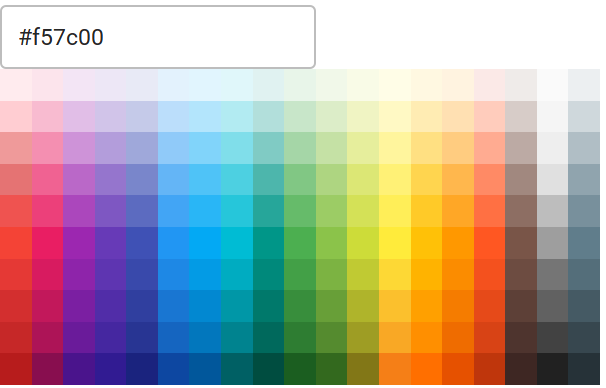
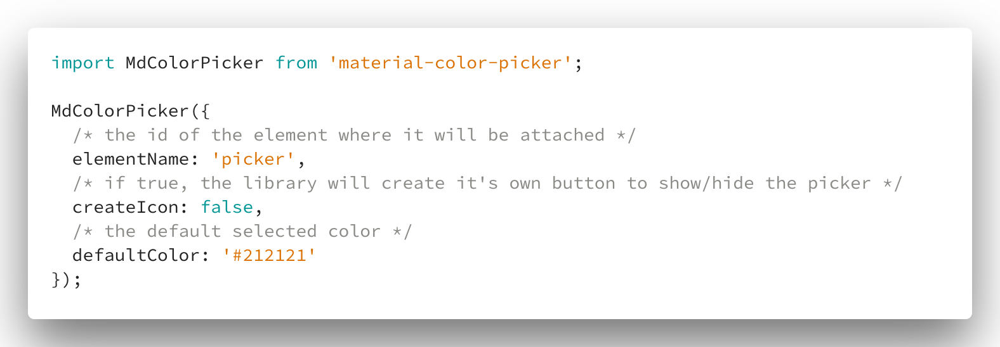
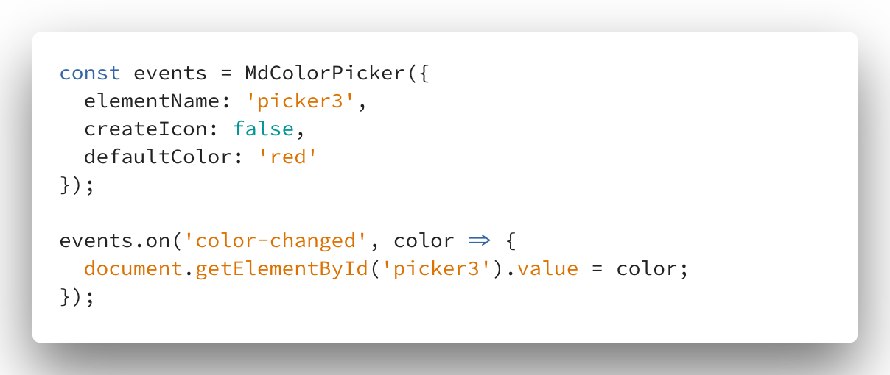

# md-color-picker

material-color-picker is a simple color picker, built with javascript & flow.

You can perform data-binding easily as the library returns an EventEmitter

---

## screenshot

---

## exemples

without data binding :

with data binding :

